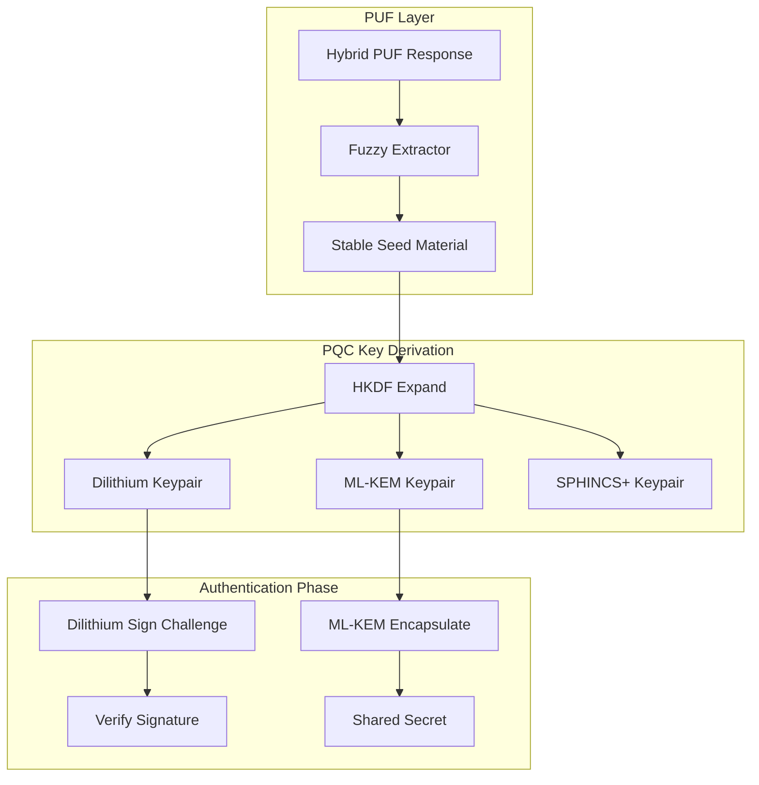
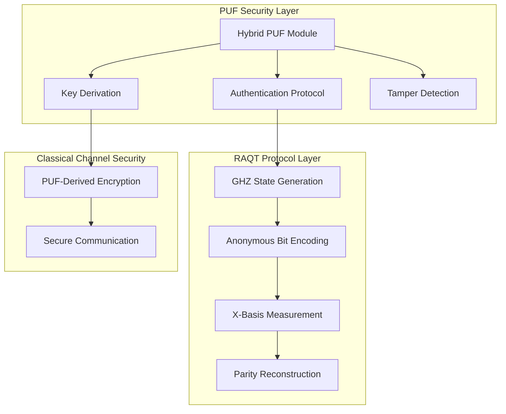
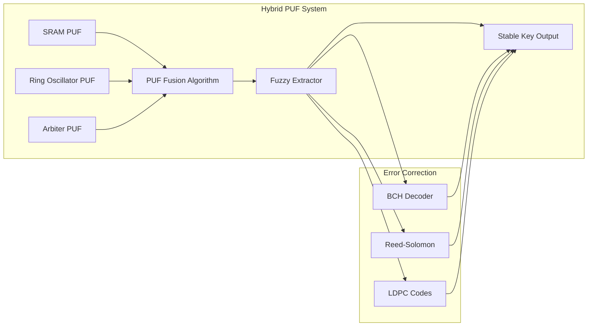
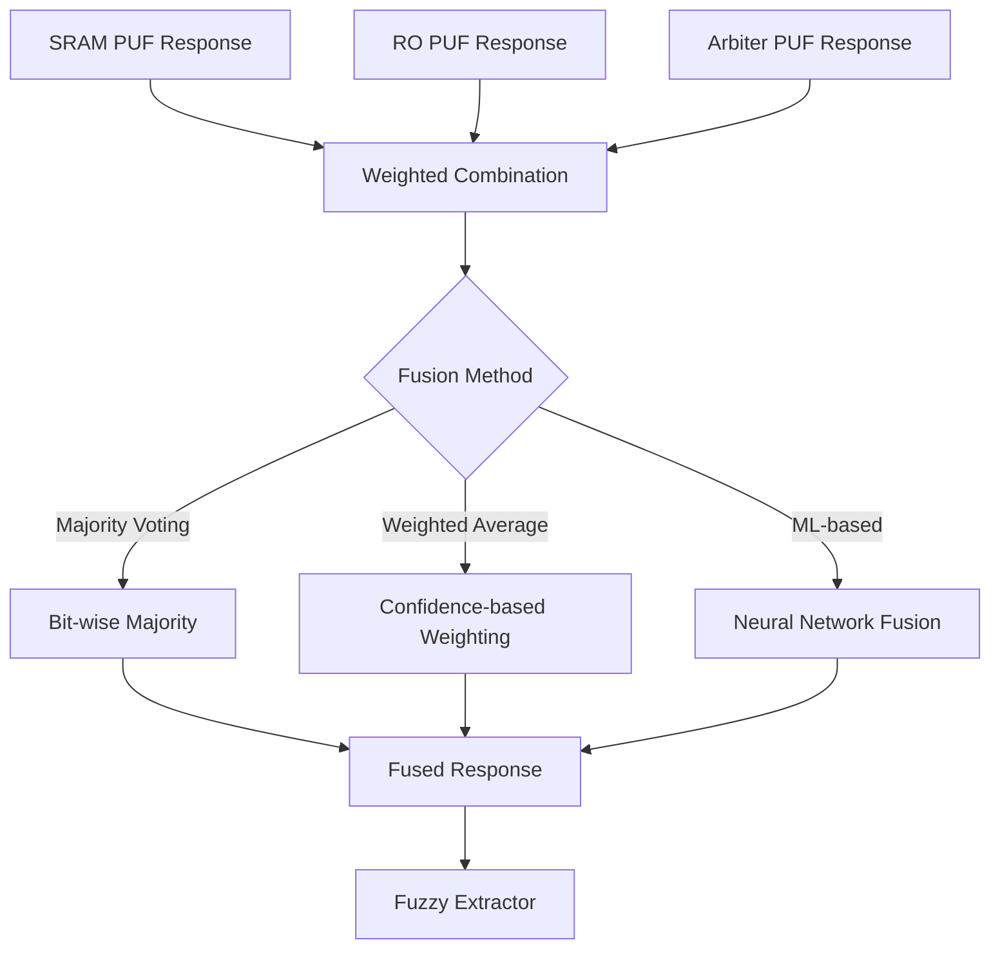
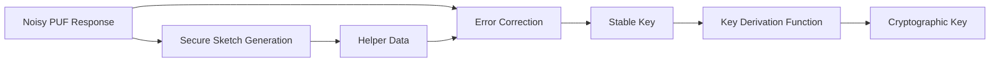
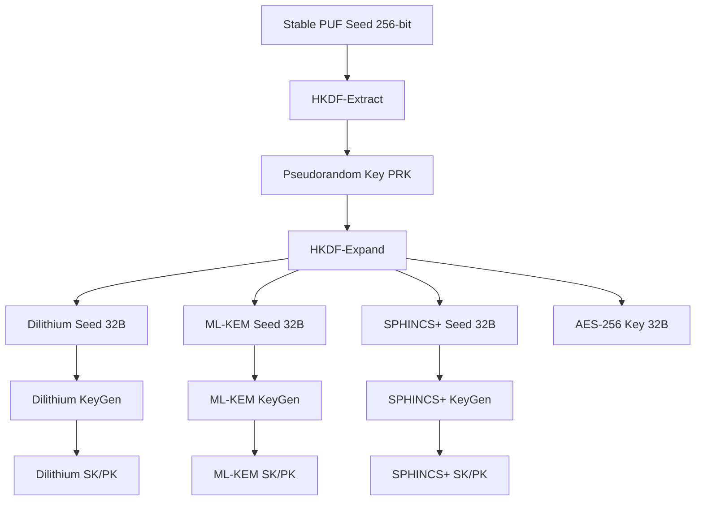
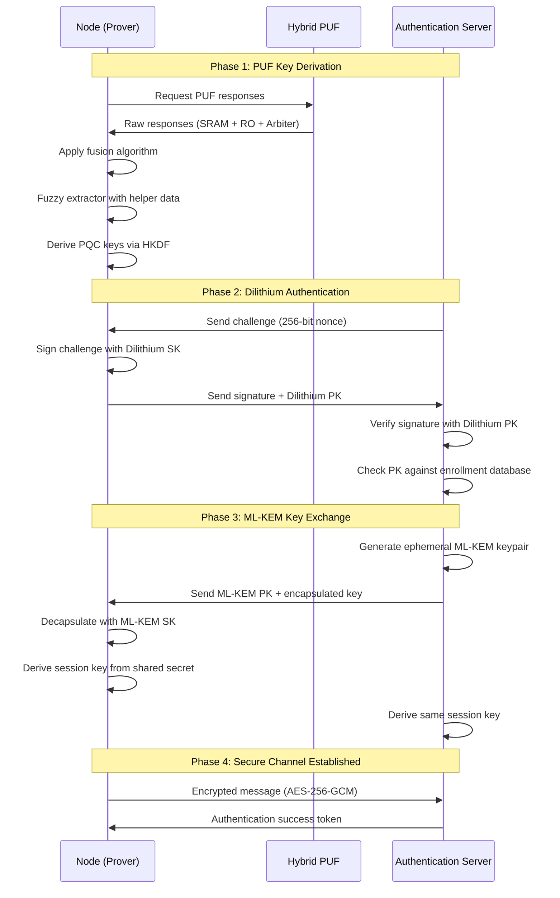
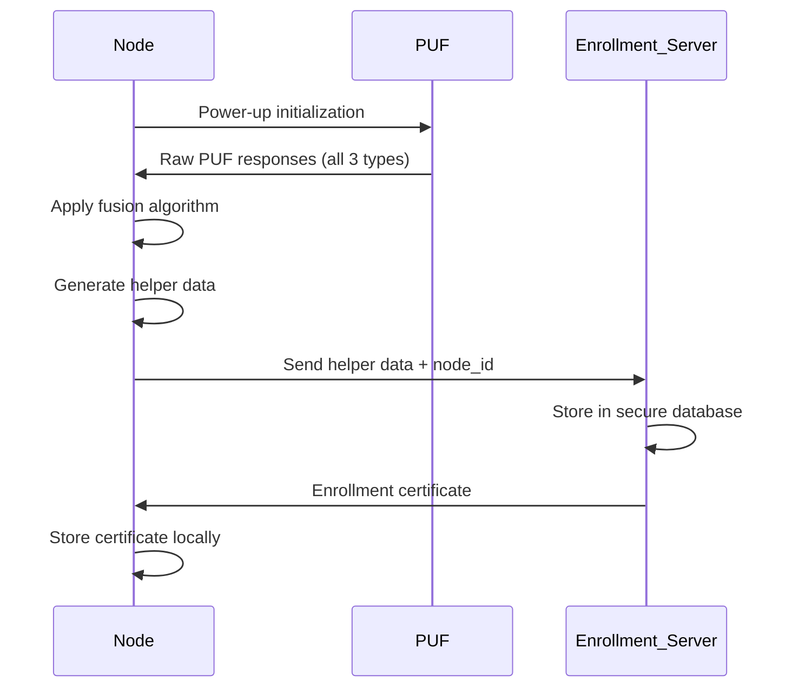
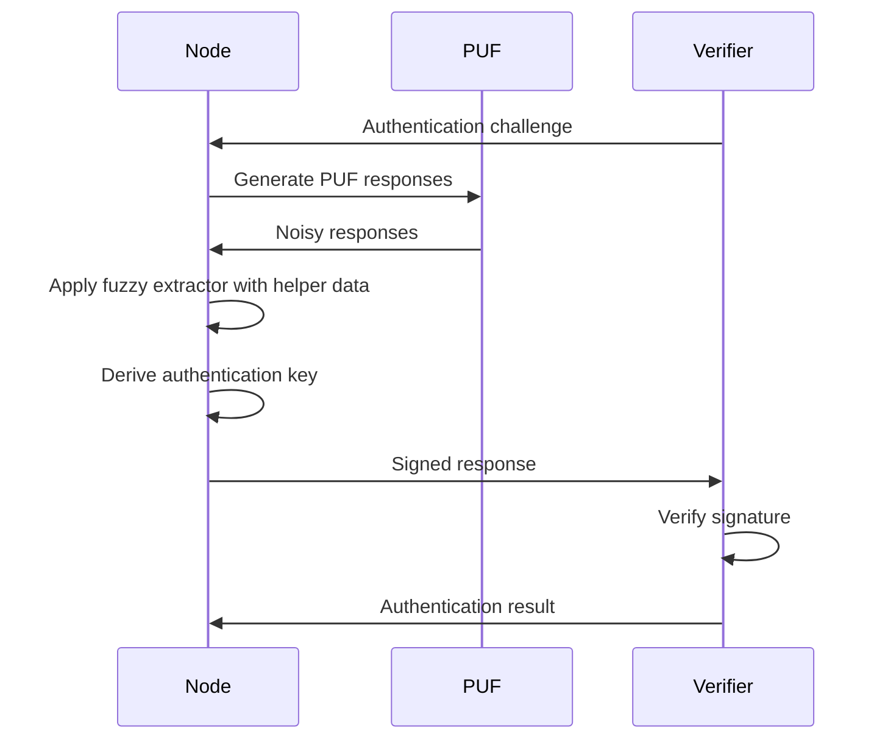
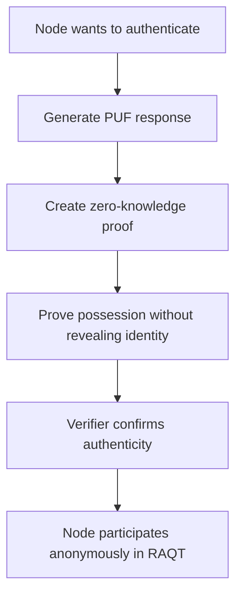

# PUF-Enhanced RAQT Protocol: Architectural Design Plan

## Executive Summary

This document outlines the integration of Physical Unclonable Functions (PUFs) into the Remote Anonymous Quantum Transmission (RAQT) protocol, creating a hardware-rooted security layer for quantum networks. The hybrid PUF approach combines SRAM, Ring Oscillator, and Arbiter PUFs to provide robust device authentication, anti-cloning protection, and secure key derivation while preserving the anonymity guarantees of the original Christandl-Wehner 2004 protocol.

---

## 1. Post-Quantum Cryptography Integration

### 1.1 NIST PQC Standards Compliance

This architecture integrates **NIST-approved Post-Quantum Cryptography (PQC)** algorithms to ensure quantum-resistant security:

- **CRYSTALS-Dilithium**: Digital signatures for authentication
- **ML-KEM (Kyber)**: Key encapsulation for secure key exchange
- **SPHINCS+**: Stateless hash-based signatures (backup)

**Rationale**: Classical cryptography (RSA, ECDSA) is vulnerable to quantum attacks via Shor's algorithm. PQC algorithms provide security against both classical and quantum adversaries.

---
### 1.2 PQC Algorithm Selection

| Algorithm | Purpose | Security Level | Key/Signature Size | Performance |
|-----------|---------|----------------|-------------------|-------------|
| **CRYSTALS-Dilithium** | Digital Signatures | NIST Level 3 | PK: 1952B, Sig: 3293B | Fast signing/verification |
| **ML-KEM (Kyber)** | Key Encapsulation | NIST Level 3 | PK: 1568B, CT: 1568B | Very fast encaps/decaps |
| **SPHINCS+** | Backup Signatures | NIST Level 3 | PK: 64B, Sig: 49856B | Slower but stateless |

**Security Level 3**: Equivalent to AES-192, provides ~192-bit quantum security.

### 1.3 PQC Integration Architecture




## 2. System Architecture Overview

### 1.1 High-Level Architecture



### 1.2 Hybrid PUF Architecture



---

## 2. Component Specifications

### 2.1 SRAM PUF Module

**Purpose**: Device fingerprinting and long-term identity establishment

**Characteristics**:
- **Entropy Source**: Power-up state of SRAM cells
- **Response Length**: 128-256 bits
- **Bit Error Rate**: ~15% (requires error correction)
- **Uniqueness**: High inter-device variation
- **Stability**: Moderate (temperature-dependent)

**Implementation Parameters**:
```python
SRAM_PUF_CONFIG = {
    'cell_count': 2048,
    'response_bits': 256,
    'noise_level': 0.15,
    'temperature_sensitivity': 0.02,
    'aging_factor': 0.001
}
```

### 2.2 Ring Oscillator PUF

**Purpose**: High-entropy key generation for cryptographic operations

**Characteristics**:
- **Entropy Source**: Frequency variations in oscillator pairs
- **Response Length**: 64-128 bits
- **Bit Error Rate**: ~5-10%
- **Uniqueness**: Very high
- **Stability**: Good (less temperature-sensitive)

**Implementation Parameters**:
```python
RO_PUF_CONFIG = {
    'oscillator_pairs': 128,
    'response_bits': 128,
    'noise_level': 0.08,
    'frequency_range': (100e6, 150e6),  # 100-150 MHz
    'measurement_time': 1e-3  # 1ms
}
```

### 2.3 Arbiter PUF

**Purpose**: Fast challenge-response authentication

**Characteristics**:
- **Entropy Source**: Race conditions in delay chains
- **Response Length**: 64 bits per challenge
- **Bit Error Rate**: ~10-12%
- **Uniqueness**: High
- **Speed**: Very fast (<1μs per challenge)

**Implementation Parameters**:
```python
ARBITER_PUF_CONFIG = {
    'delay_stages': 64,
    'response_bits': 64,
    'noise_level': 0.11,
    'delay_variation': 1e-12,  # 1ps
    'challenge_space': 2**64
}
```

---

## 3. PUF Fusion Algorithm

### 3.1 Fusion Strategy



### 3.2 Fusion Algorithms

**Option 1: Majority Voting**
- Simple and fast
- Requires odd number of PUF types
- Good for binary decisions

**Option 2: Weighted Average**
- Weights based on PUF reliability
- Better error correction
- Configurable confidence thresholds

**Option 3: ML-based Fusion**
- Neural network trained on enrollment data
- Adaptive to environmental conditions
- Highest accuracy but more complex

---

## 4. Fuzzy Extractor Design

### 4.1 Architecture



### 4.2 Error Correction Codes

**BCH Codes** (Primary):
- Parameters: BCH(255, 131, 18)
- Corrects up to 18 bit errors
- Suitable for SRAM PUF

**Reed-Solomon Codes** (Alternative):
- Parameters: RS(255, 223)
- Symbol-based correction
- Better for burst errors

**LDPC Codes** (Advanced):
- Configurable code rate
- Near Shannon-limit performance
- Higher computational cost

### 4.3 Helper Data Storage

```python
HELPER_DATA_STRUCTURE = {
    'puf_type': 'hybrid',
    'syndrome': bytes,  # Error correction syndrome
    'hash': bytes,      # Response hash for verification
    'timestamp': int,   # Enrollment time
    'metadata': dict    # Environmental conditions
}
```

---

## 4.4 PQC-Based Key Derivation Function

### 4.4.1 Key Derivation Architecture



### 4.4.2 HKDF Implementation

**HKDF (HMAC-based Key Derivation Function)** - RFC 5869

```python
# Pseudocode for PUF-to-PQC Key Derivation
def derive_pqc_keys(puf_seed: bytes) -> dict:
    """
    Derives PQC keypairs from PUF seed using HKDF
    
    Args:
        puf_seed: 256-bit stable seed from fuzzy extractor
        
    Returns:
        Dictionary containing all PQC keypairs
    """
    # Step 1: HKDF-Extract (generate PRK)
    salt = b"PUF-RAQT-2026"  # Application-specific salt
    prk = HKDF_Extract(salt, puf_seed, hash_algo=SHA3_256)
    
    # Step 2: HKDF-Expand (derive multiple keys)
    dilithium_seed = HKDF_Expand(prk, info=b"Dilithium3", length=32)
    mlkem_seed = HKDF_Expand(prk, info=b"ML-KEM-768", length=32)
    sphincs_seed = HKDF_Expand(prk, info=b"SPHINCS+-128f", length=32)
    aes_key = HKDF_Expand(prk, info=b"AES-256-GCM", length=32)
    
    # Step 3: Generate PQC keypairs deterministically
    dilithium_sk, dilithium_pk = Dilithium3.keygen(dilithium_seed)
    mlkem_sk, mlkem_pk = MLKEM768.keygen(mlkem_seed)
    sphincs_sk, sphincs_pk = SPHINCS128f.keygen(sphincs_seed)
    
    return {
        'dilithium': {'sk': dilithium_sk, 'pk': dilithium_pk},
        'mlkem': {'sk': mlkem_sk, 'pk': mlkem_pk},
        'sphincs': {'sk': sphincs_sk, 'pk': sphincs_pk},
        'aes_key': aes_key
    }
```

### 4.4.3 Key Derivation Parameters

| Parameter | Value | Purpose |
|-----------|-------|---------|
| **Hash Function** | SHA3-256 | Quantum-resistant hash |
| **Salt** | "PUF-RAQT-2026" | Domain separation |
| **Info Strings** | Algorithm-specific | Context binding |
| **PRK Length** | 256 bits | Master key material |
| **Derived Key Length** | 32 bytes each | PQC seed requirements |

**Security Properties**:
- **One-way**: Cannot reverse PRK from derived keys
- **Deterministic**: Same PUF seed → same keypairs
- **Domain Separation**: Different info strings prevent key reuse
- **Quantum-Resistant**: SHA3-256 provides 256-bit quantum security

---

## 4.5 PQC Authentication Protocol

### 4.5.1 Complete Authentication Flow



### 4.5.2 Dilithium Signature Authentication

**Algorithm**: CRYSTALS-Dilithium3 (NIST Level 3)

```python
def authenticate_with_dilithium(node_id: str, challenge: bytes) -> bool:
    """
    Authenticate node using Dilithium digital signature
    
    Args:
        node_id: Unique node identifier
        challenge: 256-bit random nonce from verifier
        
    Returns:
        True if authentication successful, False otherwise
    """
    # Node side: Generate signature
    puf_seed = get_stable_puf_seed()
    keys = derive_pqc_keys(puf_seed)
    dilithium_sk = keys['dilithium']['sk']
    dilithium_pk = keys['dilithium']['pk']
    
    # Sign challenge with timestamp to prevent replay
    timestamp = int(time.time())
    message = challenge + timestamp.to_bytes(8, 'big') + node_id.encode()
    signature = Dilithium3.sign(dilithium_sk, message)
    
    # Verifier side: Verify signature
    enrolled_pk = database.get_public_key(node_id, 'dilithium')
    
    # Check 1: Verify signature cryptographically
    is_valid = Dilithium3.verify(enrolled_pk, message, signature)
    
    # Check 2: Verify public key matches enrollment
    pk_matches = (dilithium_pk == enrolled_pk)
    
    # Check 3: Verify timestamp freshness (within 30 seconds)
    is_fresh = (abs(time.time() - timestamp) < 30)
    
    return is_valid and pk_matches and is_fresh
```

**Security Properties**:
- **Unforgeability**: Cannot forge signature without PUF access
- **Replay Protection**: Timestamp prevents replay attacks
- **Quantum Resistance**: Secure against Shor's algorithm
- **Hardware Binding**: Signature tied to physical device via PUF

### 4.5.3 ML-KEM Key Encapsulation

**Algorithm**: ML-KEM-768 (Kyber768, NIST Level 3)

```python
def establish_secure_channel(node_id: str) -> bytes:
    """
    Establish quantum-resistant secure channel using ML-KEM
    
    Args:
        node_id: Authenticated node identifier
        
    Returns:
        Shared session key (256 bits)
    """
    # Verifier side: Generate ephemeral keypair
    verifier_sk, verifier_pk = MLKEM768.keygen()
    
    # Verifier: Encapsulate shared secret
    ciphertext, shared_secret_v = MLKEM768.encapsulate(verifier_pk)
    
    # Send ciphertext to node
    send_to_node(node_id, ciphertext)
    
    # Node side: Decapsulate using PUF-derived key
    puf_seed = get_stable_puf_seed()
    keys = derive_pqc_keys(puf_seed)
    node_mlkem_sk = keys['mlkem']['sk']
    
    shared_secret_n = MLKEM768.decapsulate(node_mlkem_sk, ciphertext)
    
    # Both sides derive session key using HKDF
    session_key_v = HKDF_Expand(
        shared_secret_v, 
        info=b"RAQT-Session-" + node_id.encode(),
        length=32
    )
    
    session_key_n = HKDF_Expand(
        shared_secret_n,
        info=b"RAQT-Session-" + node_id.encode(), 
        length=32
    )
    
    # Verify both sides derived same key
    assert session_key_v == session_key_n
    
    return session_key_v
```

**Security Properties**:
- **Forward Secrecy**: Compromise of PUF doesn't reveal past sessions
- **Quantum Resistance**: Based on Module-LWE problem
- **Efficiency**: Fast encapsulation/decapsulation (~0.1ms)
- **IND-CCA2 Security**: Secure against adaptive chosen-ciphertext attacks

### 4.5.4 Hybrid Authentication Protocol

**Combined Dilithium + ML-KEM Protocol**

```python
class PQCAuthenticationProtocol:
    """
    Complete PQC authentication protocol for RAQT nodes
    """
    
    def __init__(self, node_id: str, puf_module: HybridPUF):
        self.node_id = node_id
        self.puf = puf_module
        self.keys = None
        self.session_key = None
        
    def enroll(self, enrollment_server: str) -> bool:
        """
        Enroll node with authentication server
        """
        # Generate stable PUF seed
        puf_seed, helper_data = self.puf.enroll()
        
        # Derive PQC keypairs
        self.keys = derive_pqc_keys(puf_seed)
        
        # Send public keys to enrollment server
        enrollment_data = {
            'node_id': self.node_id,
            'dilithium_pk': self.keys['dilithium']['pk'],
            'mlkem_pk': self.keys['mlkem']['pk'],
            'sphincs_pk': self.keys['sphincs']['pk'],
            'helper_data': helper_data,
            'timestamp': int(time.time())
        }
        
        # Sign enrollment data with SPHINCS+ for long-term verification
        enrollment_signature = SPHINCS128f.sign(
            self.keys['sphincs']['sk'],
            json.dumps(enrollment_data).encode()
        )
        
        return send_enrollment(enrollment_server, enrollment_data, enrollment_signature)
    
    def authenticate(self, verifier: str) -> bool:
        """
        Authenticate with verifier using Dilithium
        """
        # Receive challenge
        challenge = receive_challenge(verifier)
        
        # Regenerate keys from PUF
        puf_seed = self.puf.reconstruct()
        self.keys = derive_pqc_keys(puf_seed)
        
        # Sign challenge
        timestamp = int(time.time())
        message = challenge + timestamp.to_bytes(8, 'big') + self.node_id.encode()
        signature = Dilithium3.sign(self.keys['dilithium']['sk'], message)
        
        # Send signature and public key
        auth_response = {
            'node_id': self.node_id,
            'signature': signature,
            'public_key': self.keys['dilithium']['pk'],
            'timestamp': timestamp
        }
        
        return send_auth_response(verifier, auth_response)
    
    def establish_session(self, verifier: str) -> bytes:
        """
        Establish secure session using ML-KEM
        """
        # Receive encapsulated key
        ciphertext = receive_encapsulated_key(verifier)
        
        # Decapsulate using ML-KEM private key
        shared_secret = MLKEM768.decapsulate(
            self.keys['mlkem']['sk'],
            ciphertext
        )
        
        # Derive session key
        self.session_key = HKDF_Expand(
            shared_secret,
            info=b"RAQT-Session-" + self.node_id.encode(),
            length=32
        )
        
        return self.session_key
    
    def encrypt_message(self, plaintext: bytes) -> bytes:
        """
        Encrypt message using session key (AES-256-GCM)
        """
        nonce = os.urandom(12)  # 96-bit nonce
        cipher = AES_GCM(self.session_key)
        ciphertext, tag = cipher.encrypt(nonce, plaintext, aad=self.node_id.encode())
        
        return nonce + ciphertext + tag
    
    def decrypt_message(self, encrypted: bytes) -> bytes:
        """
        Decrypt message using session key
        """
        nonce = encrypted[:12]
        ciphertext = encrypted[12:-16]
        tag = encrypted[-16:]
        
        cipher = AES_GCM(self.session_key)
        plaintext = cipher.decrypt(nonce, ciphertext, tag, aad=self.node_id.encode())
        
        return plaintext
```

### 4.5.5 Authentication Performance Metrics

| Operation | Algorithm | Latency | Key/Signature Size |
|-----------|-----------|---------|-------------------|
| **Key Generation** | Dilithium3 | ~0.5ms | SK: 4000B, PK: 1952B |
| **Signing** | Dilithium3 | ~1.2ms | Signature: 3293B |
| **Verification** | Dilithium3 | ~0.4ms | - |
| **Encapsulation** | ML-KEM-768 | ~0.08ms | CT: 1088B |
| **Decapsulation** | ML-KEM-768 | ~0.09ms | - |
| **Total Auth Time** | Combined | ~2.3ms | - |

**Comparison with Classical Cryptography**:
- RSA-2048 signing: ~5ms (vulnerable to quantum attacks)
- ECDSA-256 signing: ~0.8ms (vulnerable to quantum attacks)
- Dilithium3 signing: ~1.2ms (quantum-resistant)

**Advantage**: Only ~0.4ms overhead for quantum resistance!


## 5. Hardware Root-of-Trust Protocol

### 5.1 Enrollment Phase



### 5.2 Verification Phase



---

## 6. Integration with RAQT Protocol

### 6.1 Enhanced Protocol Flow

```mermaid
sequenceDiagram
    participant N1 as Node 1
    participant N2 as Node 2 (Sender)
    participant N3 as Node 3
    participant N4 as Node 4
    participant Auth as Auth Server
    
    Note over N1,N4: Phase 1: PUF Authentication
    N1->>Auth: PUF-based authentication
    N2->>Auth: PUF-based authentication
    N3->>Auth: PUF-based authentication
    N4->>Auth: PUF-based authentication
    Auth->>N1,N4: Authentication tokens
    
    Note over N1,N4: Phase 2: Secure Channel Setup
    N1->>N2: Establish encrypted channel (PUF-derived keys)
    N2->>N3: Establish encrypted channel
    N3->>N4: Establish encrypted channel
    
    Note over N1,N4: Phase 3: RAQT Protocol Execution
    N1->>N1: Prepare GHZ state
    N1->>N2: Distribute entangled qubits
    N1->>N3: Distribute entangled qubits
    N1->>N4: Distribute entangled qubits
    
    N2->>N2: Apply Z gate (secret bit = 1)
    
    N1->>N1: H gate + Measure
    N2->>N2: H gate + Measure
    N3->>N3: H gate + Measure
    N4->>N4: H gate + Measure
    
    N1->>Auth: Encrypted measurement result
    N2->>Auth: Encrypted measurement result
    N3->>Auth: Encrypted measurement result
    N4->>Auth: Encrypted measurement result
    
    Auth->>Auth: XOR parity calculation
    Auth->>N1,N4: Reconstructed secret bit
```

### 6.2 Anonymity Preservation

**Challenge**: PUF authentication could compromise sender anonymity

**Solution**: Zero-Knowledge Authentication


**Implementation**: Use ring signatures or group signatures where:
- Each node proves membership in authenticated group
- Individual identity remains hidden
- Sender anonymity preserved in RAQT protocol

---

## 7. Security Analysis

### 7.1 Threat Model

| Threat | Mitigation | PUF Role |
|--------|-----------|----------|
| Device cloning | PUF uniqueness | Impossible to clone physical characteristics |
| Man-in-the-middle | Mutual authentication | PUF-based device identity verification |
| Replay attacks | Challenge-response | Fresh challenges using Arbiter PUF |
| Side-channel attacks | Constant-time operations | Timing attack resistant implementation |
| Tampering | Response monitoring | SRAM PUF detects physical modifications |
| Key extraction | Fuzzy extractor | Keys never stored, derived on-demand |

### 7.2 Security Properties

**Unclonability**: 
- Probability of successful cloning: < 2^-128
- Based on manufacturing process variations

**Unpredictability**:
- Min-entropy: ≥ 0.85 bits per PUF bit
- Combined entropy from 3 PUF types

**Tamper Evidence**:
- Detection rate: > 99.9%
- Response time: < 100ms

---

## 8. Performance Considerations

### 8.1 Latency Analysis (with PQC)

| Operation | Latency | Impact on RAQT |
|-----------|---------|----------------|
| SRAM PUF read | ~10ms | One-time enrollment |
| RO PUF measurement | ~1ms | Per-session key generation |
| Arbiter PUF challenge | ~1μs | Negligible |
| Fuzzy extraction | ~5ms | Per authentication |
| **PQC Key Derivation (HKDF)** | **~2ms** | **Per authentication** |
| **Dilithium3 Signing** | **~1.2ms** | **Per authentication** |
| **Dilithium3 Verification** | **~0.4ms** | **Per authentication** |
| **ML-KEM Encapsulation** | **~0.08ms** | **Per session** |
| **ML-KEM Decapsulation** | **~0.09ms** | **Per session** |
| **Total PQC overhead** | **~3.8ms** | **Quantum-resistant security** |
| **Total authentication overhead** | **~19.8ms** | **Acceptable for quantum networks** |

**Performance Impact**: Adding PQC increases authentication time by only ~3.8ms while providing quantum resistance.

### 8.2 Resource Requirements (with PQC)

```python
RESOURCE_ESTIMATES = {
    'memory': {
        'helper_data': '2KB per node',
        'puf_responses': '512 bytes (temporary)',
        'puf_seed': '32 bytes (derived)',
        'dilithium_sk': '4000 bytes',
        'dilithium_pk': '1952 bytes',
        'mlkem_sk': '2400 bytes',
        'mlkem_pk': '1184 bytes',
        'sphincs_sk': '128 bytes',
        'sphincs_pk': '64 bytes',
        'session_key': '32 bytes',
        'total_per_node': '~12KB'
    },
    'computation': {
        'enrollment': 'One-time, ~120ms (includes PQC keygen)',
        'authentication': 'Per-session, ~23ms (includes PQC ops)',
        'key_derivation': 'On-demand, ~7ms (includes HKDF + PQC)'
    },
    'communication': {
        'helper_data_exchange': '2KB',
        'dilithium_signature': '3293 bytes',
        'mlkem_ciphertext': '1088 bytes',
        'challenge_response': '~5KB total'
    }
}
```

**Storage Comparison**:
- Classical (RSA-2048): ~4KB per node
- PQC (Dilithium + ML-KEM): ~12KB per node
- **Overhead**: 3x storage for quantum resistance

---

## 9. Implementation Roadmap

### Phase 1: Core PUF Simulation (Weeks 1-2)
- Implement SRAM PUF simulator with realistic noise
- Implement Ring Oscillator PUF with frequency modeling
- Implement Arbiter PUF with delay chain simulation
- Unit tests for each PUF type

### Phase 2: Fusion and Error Correction (Weeks 3-4)
- Develop fusion algorithms (majority voting, weighted, ML)
- Implement BCH error correction
- Implement fuzzy extractor with HKDF
- Integration tests

### Phase 3: PQC Integration (Weeks 5-6)
- **Integrate CRYSTALS-Dilithium for signatures**
- **Integrate ML-KEM for key encapsulation**
- **Integrate SPHINCS+ as backup**
- **Implement PQC key derivation from PUF seeds**
- **Unit tests for PQC operations**

### Phase 4: Authentication Protocol (Weeks 7-8)
- Design PQC-based enrollment protocol
- Implement Dilithium challenge-response authentication
- Implement ML-KEM session establishment
- Add zero-knowledge proof for anonymity preservation
- Security testing

### Phase 5: RAQT Integration (Weeks 9-10)
- Integrate PUF+PQC layer with existing RAQT code
- Add AES-256-GCM encryption for classical channels
- Implement tamper detection
- End-to-end testing

### Phase 6: Documentation and Benchmarking (Weeks 11-12)
- Performance benchmarking suite with PQC metrics
- Security analysis documentation
- API reference and tutorials
- Configuration examples
- **PQC compliance documentation**

---

## 10. File Structure

```
BOB_the_Builder_Quantum_Network/
├── src/
│   ├── puf/
│   │   ├── __init__.py
│   │   ├── sram_puf.py
│   │   ├── ro_puf.py
│   │   ├── arbiter_puf.py
│   │   ├── fusion.py
│   │   └── fuzzy_extractor.py
│   ├── crypto/
│   │   ├── __init__.py
│   │   ├── key_derivation.py
│   │   ├── error_correction.py
│   │   └── encryption.py
│   ├── auth/
│   │   ├── __init__.py
│   │   ├── enrollment.py
│   │   ├── verification.py
│   │   └── zero_knowledge.py
│   ├── raqt/
│   │   ├── __init__.py
│   │   ├── protocol.py (enhanced)
│   │   ├── puf_integration.py
│   │   └── secure_channel.py
│   └── utils/
│       ├── __init__.py
│       ├── config.py
│       └── logging.py
├── tests/
│   ├── test_puf.py
│   ├── test_fusion.py
│   ├── test_auth.py
│   └── test_integration.py
├── benchmarks/
│   ├── performance.py
│   └── security_analysis.py
├── configs/
│   ├── default.yaml
│   ├── high_security.yaml
│   └── low_latency.yaml
├── docs/
│   ├── API_Reference.md
│   ├── Tutorial.md
│   └── Security_Analysis.md
├── examples/
│   ├── basic_authentication.py
│   ├── full_raqt_with_puf.py
│   └── custom_puf_config.py
├── RAQTNetSquid (1).py (existing)
├── README.md (updated)
└── requirements.txt
```

---

## 11. Configuration System

### 11.1 Example Configuration File

```yaml
# config/default.yaml
puf:
  hybrid:
    enabled: true
    fusion_method: "weighted_average"
    
  sram:
    cell_count: 2048
    response_bits: 256
    noise_level: 0.15
    
  ring_oscillator:
    oscillator_pairs: 128
    response_bits: 128
    noise_level: 0.08
    
  arbiter:
    delay_stages: 64
    response_bits: 64
    noise_level: 0.11

error_correction:
  method: "BCH"
  parameters:
    n: 255
    k: 131
    t: 18

# Post-Quantum Cryptography Configuration
pqc:
  enabled: true
  
  dilithium:
    variant: "Dilithium3"  # NIST Level 3
    mode: "standard"
    
  mlkem:
    variant: "ML-KEM-768"  # Kyber768, NIST Level 3
    
  sphincs:
    variant: "SPHINCS+-128f"  # Fast variant
    enabled: false  # Backup only
    
  key_derivation:
    function: "HKDF"
    hash: "SHA3-256"
    salt: "PUF-RAQT-2026"
    info_prefix: "RAQT-Node-"

authentication:
  protocol: "pqc_challenge_response"
  signature_algorithm: "Dilithium3"
  key_exchange: "ML-KEM-768"
  anonymity: true
  zero_knowledge: true
  challenge_length: 256
  timestamp_window: 30  # seconds

raqt:
  num_nodes: 4
  shots: 500
  noise_model: "depolarizing"
  gate_error: 0.02
  channel_noise: 0.05

security:
  key_derivation: "HKDF-SHA3-256"
  encryption: "AES-256-GCM"
  tamper_detection: true
  side_channel_protection: true
  quantum_resistant: true
  nist_compliance: true
```

---

## 12. Testing Strategy

### 12.1 Unit Tests
- Individual PUF module correctness
- Fusion algorithm accuracy

---

## 11.2 Python Dependencies (requirements.txt)

```txt
# PUF-Enhanced RAQT Protocol Requirements
# Python 3.10+

# ============================================
# Quantum Network Simulation
# ============================================
netsquid>=1.1.0

# ============================================
# Post-Quantum Cryptography (NIST-approved)
# ============================================
# CRYSTALS-Dilithium (Digital Signatures)
pqcrypto>=0.1.0
dilithium-py>=1.0.0

# ML-KEM / Kyber (Key Encapsulation)
kyber-py>=0.3.0
pqc-kyber>=1.0.0

# SPHINCS+ (Stateless Hash-based Signatures)
sphincsplus>=0.1.0

# Alternative: Use liboqs Python bindings for all PQC algorithms
liboqs-python>=0.8.0

# ============================================
# Cryptographic Primitives
# ============================================
cryptography>=41.0.0  # AES-GCM, HKDF, SHA3
pycryptodome>=3.19.0  # Additional crypto primitives

# ============================================
# Error Correction Codes
# ============================================
bchlib>=0.14.0  # BCH codes for fuzzy extractor
reedsolo>=1.7.0  # Reed-Solomon codes
pyldpc>=0.7.9  # LDPC codes

# ============================================
# Numerical and Scientific Computing
# ============================================
numpy>=1.24.0
scipy>=1.11.0
matplotlib>=3.7.0  # For visualization

# ============================================
# Configuration and Data Handling
# ============================================
pyyaml>=6.0.1  # YAML configuration files
toml>=0.10.2  # Alternative config format
python-dotenv>=1.0.0  # Environment variables

# ============================================
# Testing and Quality Assurance
# ============================================
pytest>=7.4.0
pytest-cov>=4.1.0
pytest-benchmark>=4.0.0
hypothesis>=6.82.0  # Property-based testing

# ============================================
# Code Quality and Linting
# ============================================
black>=23.7.0  # Code formatting
flake8>=6.1.0  # Linting
mypy>=1.5.0  # Type checking
pylint>=2.17.0  # Additional linting

# ============================================
# Documentation
# ============================================
sphinx>=7.1.0
sphinx-rtd-theme>=1.3.0
myst-parser>=2.0.0  # Markdown support in Sphinx

# ============================================
# Performance Profiling
# ============================================
memory-profiler>=0.61.0
line-profiler>=4.1.0
py-spy>=0.3.14

# ============================================
# Utilities
# ============================================
tqdm>=4.66.0  # Progress bars
colorlog>=6.7.0  # Colored logging
click>=8.1.7  # CLI interface

# ============================================
# Optional: Machine Learning (for ML-based PUF fusion)
# ============================================
# torch>=2.0.0  # PyTorch for neural networks
# scikit-learn>=1.3.0  # Traditional ML algorithms
```

### Installation Instructions

```bash
# Create virtual environment
python -m venv puf_raqt_env

# Activate environment
# On Windows:
puf_raqt_env\Scripts\activate
# On Linux/Mac:
source puf_raqt_env/bin/activate

# Install dependencies
pip install --upgrade pip
pip install -r requirements.txt

# Install NetSquid (requires license)
# Follow instructions at: https://netsquid.org

# Verify PQC installation
python -c "from liboqs import Signature, KEM; print('PQC libraries installed successfully')"
```

### Alternative: Using liboqs for All PQC

If you prefer a unified PQC library, use **liboqs** which provides all NIST-approved algorithms:

```bash
# Install liboqs system library first
# On Ubuntu/Debian:
sudo apt-get install liboqs-dev

# On macOS:
brew install liboqs

# Then install Python bindings
pip install liboqs-python
```

**liboqs Supported Algorithms**:
- Dilithium2, Dilithium3, Dilithium5
- Kyber512, Kyber768, Kyber1024 (ML-KEM)
- SPHINCS+-SHA2-128f, SPHINCS+-SHA2-128s, etc.

- Error correction capability
- Key derivation determinism

### 12.2 Integration Tests
- PUF enrollment workflow
- Authentication protocol
- RAQT protocol with PUF layer
- Secure channel establishment

### 12.3 Security Tests
- Clone detection rate
- Replay attack resistance
- Side-channel attack mitigation
- Anonymity preservation

### 12.4 Performance Tests
- Latency measurements
- Throughput analysis
- Resource utilization
- Scalability testing

---

## 13. Research Contributions

This PUF-enhanced RAQT implementation contributes to:

1. **Hardware-Rooted Quantum Security**: First integration of hybrid PUFs with anonymous quantum protocols
2. **Practical Quantum Networks**: Addresses real-world authentication needs while preserving quantum anonymity
3. **Configurable Research Platform**: Enables experimentation with different PUF configurations and security protocols
4. **Performance Benchmarking**: Provides realistic performance data for PUF-quantum protocol integration

---

## 14. Future Extensions

### 14.1 Advanced Features
- Machine learning-based PUF modeling
- Quantum PUF integration (when hardware available)
- Multi-party computation for distributed authentication
- Post-quantum cryptography integration

### 14.2 Hardware Deployment
- FPGA implementation guidelines
- ASIC design considerations
- Integration with quantum hardware platforms
- Real-world testbed deployment

---

## 15. References

1. Christandl, M., & Wehner, S. (2004). "Quantum Anonymous Transmissions"
2. Gassend, B., et al. (2002). "Silicon Physical Random Functions"
3. Maes, R., & Verbauwhede, I. (2010). "Physically Unclonable Functions: A Study on the State of the Art"
4. Dodis, Y., et al. (2008). "Fuzzy Extractors: How to Generate Strong Keys from Biometrics"
5. NetSquid Documentation: https://netsquid.org

---

## Conclusion

This architectural plan provides a comprehensive roadmap for integrating hybrid PUF technology into the RAQT protocol, creating a hardware-rooted secure quantum network suitable for research and academic experimentation. The modular design allows for flexible configuration and experimentation with different security parameters while maintaining the core anonymity guarantees of the original protocol.

**Next Steps**: Review this plan and proceed to implementation phase using Code mode.